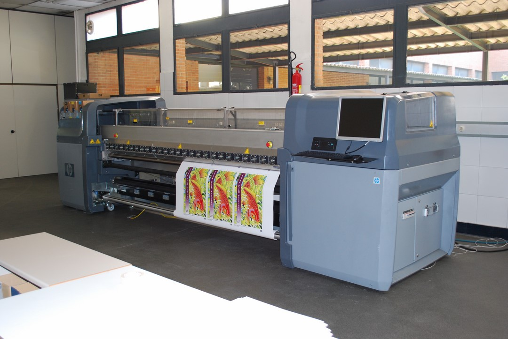

# ⚙️ 2. Características principales

<strong>
Alta precisión: Permite imprimir líneas detalladas y exactas.

Gran formato: Capaz de imprimir en tamaños superiores a los de una impresora estándar.

Uso de diferentes materiales: Puede trabajar sobre papel, cartón, vinilo, tela, entre otros.

Diversos métodos de impresión: Dependiendo del tipo de plotter, puede emplear tinta, láser o corte para plasmar los diseños.

Velocidad variable: Aunque son más lentos que las impresoras tradicionales, compensan con su calidad y precisión. 📏✨
</strong>

  

[Tipos](tipos.md)
